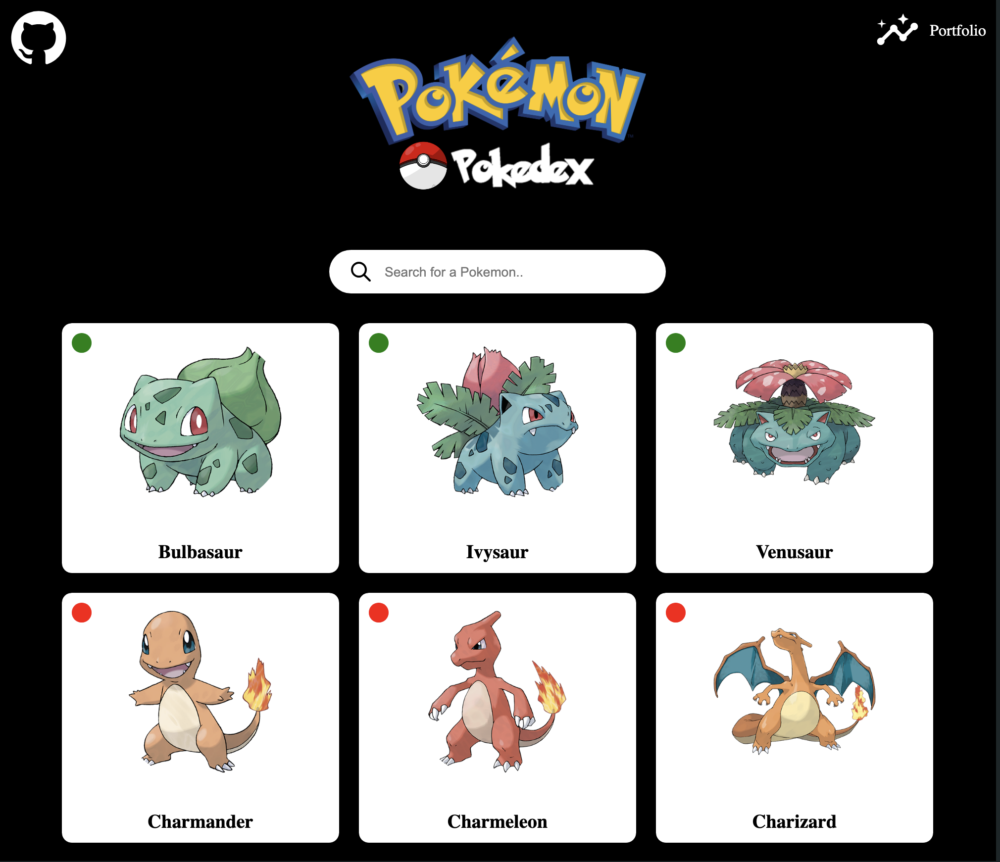

Pokedex ForzaLabs

Pokedex ForzaLabs is a small web application built with React, Vite, and MantineUI. It utilizes the PokeAPI to fetch data about Pokémon and allows users to search for a specific Pokémon and view its characteristics. The app is responsive and dynamically changes colors based on the type of Pokémon (e.g., fire, water, grass).

[Demo](https://pokedex-forza-labs.vercel.app/)

Features
Search for Pokémon.
View detailed information about each Pokémon, including its height, weight, type, and stats.
Responsive design for a seamless experience across devices.
Dynamic color scheme based on Pokémon type.

Technologies Used

React: JavaScript library for building user interfaces

Vite: Next-generation frontend build tool

MantineUI: React components library for faster and easier web development

[PokeAPI](URL_del_link): RESTful API for Pokémon data

Screenshots

Installation
To run this project locally, follow these steps:

Clone the repository:

bash
Copy code
git clone https://github.com/Vince-mel/Pokedex_ForzaLabs.git
Navigate into the project directory:

bash
Copy code
cd Pokedex_ForzaLabs
Install dependencies:

bash
Copy code
npm install
Start the development server:

bash
Copy code
npm run dev
Open your browser and visit http://localhost:3000 to view the app.
